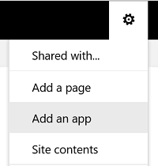
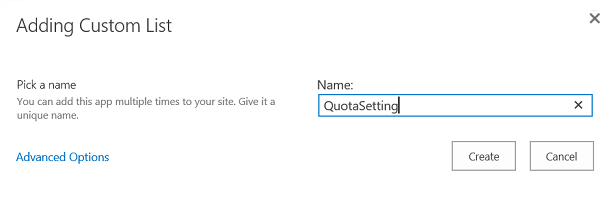
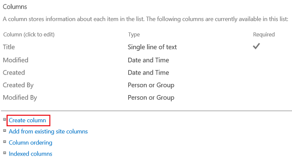
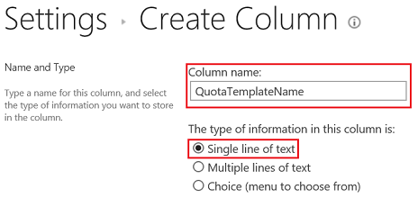
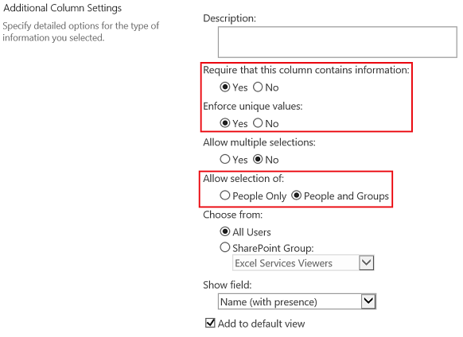
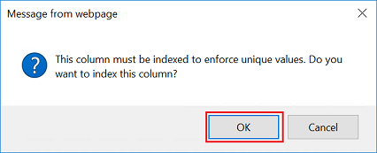
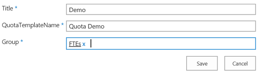
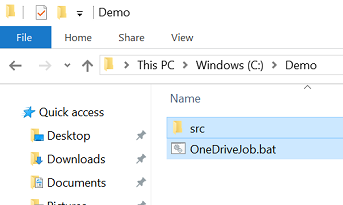
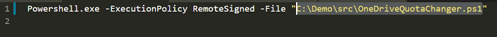
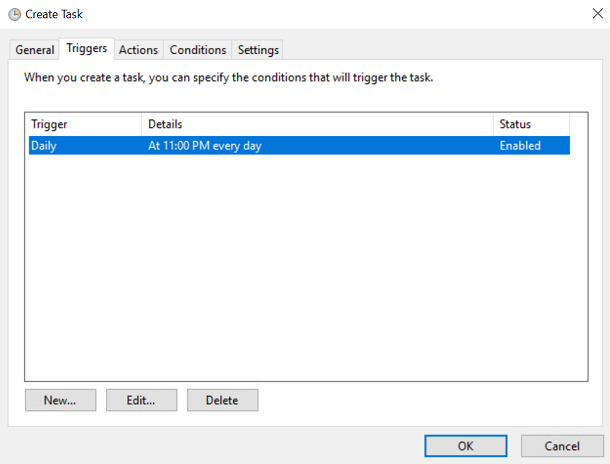

# onedrive-quota-changer

[English](README.md)

基于SharePoint组自动更改OneDrive站点的配额模板。例如，分配300M给经理，分配200M给FTE。

## 步骤
1. [在 _SharePoint 管理中心_ 中创建 __配额模板__](#在-sharepoint-管理中心中创建配额模板)
2. [在拥有这些 SharePoint 组的网站集中创建配额设置列表](#在拥有这些-sharepoint-组的网站集中创建配额设置列表)
3. [在 _SharePoint 管理中心_ 角色的 SharePoint 服务器上保存 shell 文件](#在-sharepoint-管理中心角色的-sharepoint-服务器上保存-shell-文件)
4. [在 _任务计划_ 程序中创建任务](#在任务计划程序中创建任务)

## 在 SharePoint 管理中心中创建配额模板
1. 使用 __场管理员__ 账号登录 _SharePoint 管理中心_
2. 点击 __应用程序管理__ - > __指定配额模板__（在 __站点集__ 下）

    

3. 选中 __创建一个新的配额模板__ 并输入 __新的模板名称__
4. 指定限制值

    

5. 点击 __确定__

## 在拥有这些 SharePoint 组的网站集中创建配额设置列表
_我有一个 SharePoint 站点集，TestForOneDrive (http://sp/Sites/TestForOneDrive)。它有两个 SharePoint 组，即 FTE 和 经理。所以我会在本演示中使用这个站点集。_

1. 打开 __站点集__
2. 点击 __设置图标__ - > __添加应用程序__

    

3. 点击 __自定义列表__

    

4. 命名为“ __QuotaSetting__ ” （__不要改动，稍后可以更改__）并单击 __创建__

    

5. 去设置这个列表

    

6. 在此列表中创建两个字段

    

    - 创建一个字符串字段 __QuotaTemplateName__（__不要改动，稍后可以更改__）

        
        
        

    - 创建一个个人或组字段 __Group__（__不要改动，稍后可以更改__）

        

        

        

7. 您现在可以更改此列表和上述字段的名称（_可选_）

    

    

8. 转到此列表以添加设置信息

    

    

## 在 SharePoint 管理中心角色的 SharePoint 服务器上保存 shell 文件

1. 登录服务器
2. 打开要存储脚本文件的文件夹（本演示中是 _C:\Demo_）
3. 将脚本文件（[OneDriveJob.bat](OneDriveJob.bat) 和 [src 文件夹](src)）下载到此文件夹中

    

4. 修改文件 _/src/OneDriveQuotaChanger.ps1_，将`$quotaSettingSiteUrl`的值更改为您的站点集地址（本演示中是 _http://sp/Sites/TestForOneDrive_）

    

5. 修改文件 _OneDriveJob.bat_，根据您设置的文件更改文件地址（本演示中是 _C:\Demo\src\OneDriveQuotaChanger.ps1_）

    

## 在任务计划程序中创建任务

1. 用 __场管理员__ 账号登录 _SharePoint 管理中心_ 角色的服务器
2. 打开 _计划任务_

    

3. 点击 __创建任务__（在右侧面板的 __操作__ 下）

    

4. 创建一个任务，用您的规则运行 _OneDriveJob.bat_

    

    

    

5. 点击 __确认__