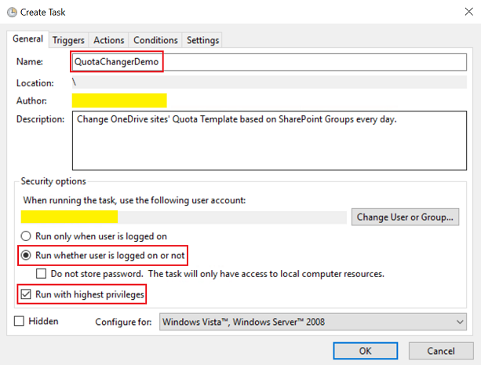

# onedrive-quota-changer

[简体中文](README-ZHCN.md)

Automatically change OneDrive sites' Quota Template based on SharePoint Groups. For example, assign 300M to managers, assign 200M to FTEs.

## Steps
1. [Create __Quota Template__ in _SharePoint Central Administration_](#create-quota-template-in-sharepoint-central-administration)
2. [Create a quota settings list in the site collection that owns these SharePoint groups](#create-a-quota-settings-list-in-the-site-collection-that-owns-these-sharepoint-groups)
3. [Save shell files on the SharePoint server that hosts _SharePoint Central Administration_](#save-shell-files-on-the-sharepoint-server-that-hosts-sharepoint-central-administration)
4. [Create Task in _Task Scheduler_](#create-task-in-task-scheduler)

## Create Quota Template in SharePoint Central Administration
1. Login _SharePoint Central Administration_ with a __Farm Administrater__
2. Click __Application Management__ -> __Specify quota templates__ (Under __Site Collections__)
    
    

3. Check __Create a new quota template__ and input __New template name__
4. Specify limitation values

    

5. Click __OK__

## Create a quota settings list in the site collection that owns these SharePoint groups
_I have a SharePoint site collection, Test for OneDrive (http://sp/Sites/TestForOneDrive). It owns two SharePoint groups, FTEs and Managers. So I'll use this site collection in this demo._

1. Open the target __Site Collection__
2. Click __Setting Icon__ -> __Add an app__
    
    

3. Click __Custom List__

    

4. Name the list with "__QuotaSetting__" (__DON'T CHANGE IT NOW, YOU CAN CHANGE IT LATER__) and click __Create__

    

5. Get to set this list

    

6. Create two columns for this list

    

    - Create a string column __QuotaTemplateName__ (__DON'T CHANGE IT NOW, YOU CAN CHANGE IT LATER__)
    
        
        
        

    - Create a Person or Group column __Group__ (__DON'T CHANGE IT NOW, YOU CAN CHANGE IT LATER__)

        

        

        

7. You can change the name for this list and above columns now (_optional_)

    

    

8. Go to this list to add settings

    

    

## Save shell files on the SharePoint server that hosts SharePoint Central Administration

1. Login the server
2. Open the folder that you want to save shell files (_C:\Demo_ in this demo)
3. Download shell files ([OneDriveJob.bat](OneDriveJob.bat) and [Folder src](src)) into this folder

    

4. Modify file _/src/OneDriveQuotaChanger.ps1_, change the value of `$quotaSettingSiteUrl` to your site collection (_http://sp/Sites/TestForOneDrive_ in this demo)

    

5. Modify file _OneDriveJob.bat_, change the file location as what you set (_C:\Demo\src\OneDriveQuotaChanger.ps1_ in this demo)

    

## Create Task in Task Scheduler

1. Login the server that hosts _SharePoint Central Administration_ as a __Farm Administrator__
2. Open _Task Scheduler_

    

3. Click __Create Task__ (Under __Actions__ in the right panel)

    

4. Create a task to run _OneDriveJob.bat_ with your logic

    

    

    

5. Click __OK__ and enjoy it
